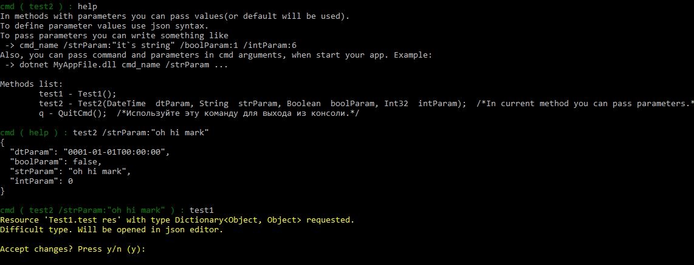

# IRO Tools main repository

In current repository you can see sources of my nuget packages, which I use as a foundation for my more specific libs and projects.

All available on [nuget.org](nuget.org).

Else projects based on it:
- [IRO.Mvc.MvcExceptionHandler](https://github.com/IT-rolling-out/IRO.Mvc/tree/master/src/Mvc/IRO.Mvc.MvcExceptionHandler) - flexible exception handler for ASP.NET Core.
- [IRO.Mvc.CoolSwagger](https://github.com/IT-rolling-out/IRO.Mvc/tree/master/src/Mvc/IRO.Mvc.CoolSwagger) - Swashbuckle extensions.
- [IRO.Mvc.PureBinding](https://github.com/IT-rolling-out/IRO.Mvc/tree/master/src/Mvc/IRO.Mvc.PureBinding) - model binder for controller methods.

### Contributing

1. [How to build?](docs/Contributing/Build.md)
1. [Solution architecture and naming style.](docs/Contributing/Sln.md)
1. [What is Resharper.Dotnet?](docs/Contributing/Resharper.md)

# Below is a description and examples of projects in this repository.

### IRO.CmdLine

Powerfull lib for creating command line interfaces.

Initialization:

```csharp
        static void Main(string[] args)
        {
            var cmds = new CmdSwitcher();
            cmds.PushCmdInStack(new CmdLineFacade());
            cmds.ExecuteStartup(args);
            if (args.Length == 0) 
                cmds.RunDefault();
            Console.ReadLine();
        }
```

Write cmd facade class:

```csharp
        [CmdInfo]
        public void Test1()
        {
            //Easy read complex objects with newtonsoft json.
            //Will be opened default text editor with example value.
            var res = ReadResource<Dictionary<object, object>>("test res");
        }

        [CmdInfo(Description = "In current method you can pass parameters.")]
        public void Test2(DateTime dtParam, string strParam, bool boolParam, int intParam)
        {
            //Easy print complex objects with newtonsoft json.
            Cmd.WriteLine(new Dictionary<string, object>()
            {
                {nameof(dtParam), dtParam},
                {nameof(boolParam), boolParam},
                {nameof(strParam),strParam },
                {nameof(intParam),intParam }
            });
        }
```

Usage:



And you can call it through cmd.exe . Just add you app to PATH environment variable and call command in it like default.

The best example of such CLI util - is IRO.FileIO.FilesReplacerUtil.CmdUtil .

### IRO.Storage

Simple key-value storage for client applications.

```csharp
    await storage.Set("key", 100);
    var num = (int)await storage.Get(typeof(int), "key");
    num = await storage.Get<int>("key");
    int? nullableNum = await storage.GetOrDefault<int?>("key");
    
	//Remove
    await storage.Set("key", null);
	await storage.Remove("key");
```

Implemented storages:
- json file;
- ram storage;
- based on litedb.

Has default caching and cross-process synchronization.

### IRO.Threading

Now contains only ThreadSyncContext which can help you working with specific threads.
Wpf example. How you can get value of wpf ui contol (with passing exceptions to calling thread):

```csharp
    Visibility value = default(Visibility);
    Exception internalException = null;
    control.Dispatcher.Invoke(()=>
    {
        try
        {
            value = control.Visibility;
        }
        catch(Exception ex)
        {
            internalException = ex;
        }
    });
    if(internalException!=null)
        throw internalException;
    return value;
```

How you can do it with ThreadSyncContext:

```csharp
    return ThreadSyncContext.Invoke(()=> control.Visibility);
```

### IRO.EmbeddedResources

Helps to read or extract embedded resource files and directories.

### IRO.Cache

Has cache service interface and simplest implemention (based on records count). Good solution for client apps.

### IRO.FileIO.ImprovedFileOperations

Class ImprovedFile has some operations same to File/Directory classes, but recursive and with logging. 
Used in my own project, but can be useful for you.

### IRO.Reflection.Core

Add some base reflection operations. What you can do:
- get type name just same as c# code (default generic names is not same);
- build Type inheritance tree (and convert it to sorted list;
- invoke any method with json array or complex object. Useful to build cross-process interfaces;
- find assignable types;
- find types with attribute4
- create generic list or dictionary with reflection;
- create types recursive.

### IRO.Reflection.SummarySearch

Work with members xml comments through reflection classes like Type, MethodInfo, PropertyInfo etc.

```csharp
    var xml = DocsParser.XmlFromMethod(context.MethodInfo);
    string summaryText = DocsParserExtensions.XmlSummaryToString(xml);
```

NOTE: Add following code to your csproj PropertyGroup to enable generation of summary files.

```xml
    <GenerateDocumentationFile>true</GenerateDocumentationFile>
	<NoWarn>$(NoWarn);1591</NoWarn>
```

### IRO.Reflection.CodeGen

Most important class of current assembly is SourceFileContext.

Current class can allow you opportunity to simple manage dependencies of cs files and than use it to generate using section and compile your code in runtime.

```csharp
            const string Source = @"
//Use types from different namespaces and assemblies.
public class GenClass1
{
    public int Num { get; set; }=100;
    
    public Stream SomeProp1 { get; set; }

    public List<string> SomeProp2 { get; set; }

    public Task<Dictionary<string, MemberInfo>> SomeMethod1(){ return null; }
}
";
            //Easy manage depemdensies.
            var ctx = new SourceFileContext();
            ctx.UsedType(typeof(int));
            ctx.UsedType(typeof(Stream));
            ctx.UsedType(typeof(List<string>));

            //Works with generic parameters automatically.
            ctx.UsedType(typeof(Task<Dictionary<string, MemberInfo>>));

            //Add namespace and usings.
            var source = CodeGenExtensions.WrapClass(
                Source,
                "MyNamespace",
                ctx.GetNamespaces()
                );
            var compilerInputData = new CompilerInputData()
            {
                CSharpCode = source,
                ReferencedAssemblies = ctx.GetAssemblies()
            };
            var assembly = Compiler.Compile(compilerInputData);
            var type = assembly.GetType("MyNamespace.GenClass1");
            dynamic modelInstance = Activator.CreateInstance(type);
            int num = modelInstance.Num;
```