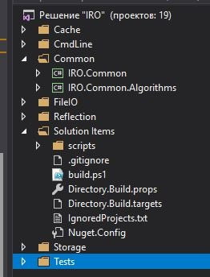

# Solution architecture and naming style

## Configuring csproj files

All common configurations must be saved in Directory.Build.{...} files (in root).
these files will be imported to each csproj. 

More info about it you can read in comments in these files or on [Customize your build: C#, Visual Basic](https://docs.microsoft.com/en-us/visualstudio/msbuild/customize-your-build?view=vs-2017) .

Example

```xml
<!-- Imported before all csproj items. Here better to define variables or default properties. -->
<Project>
  <PropertyGroup>
    <IsTest>false</IsTest>
    <IsNuPackage>false</IsNuPackage>
  </PropertyGroup>
  <PropertyGroup Condition = "($(MSBuildProjectName.StartsWith('IRO.SlnTests')) Or $(MSBuildProjectName.StartsWith('IRO.SlnUnitTests')))">
    <IsTest>true</IsTest>
  </PropertyGroup>
  <PropertyGroup  Condition = "$(MSBuildProjectName.StartsWith('IRO.')) And !$(IsTest)" >
    <IsNuPackage>true</IsNuPackage>
  </PropertyGroup>


  <!-- Use default settings: comments generation, build packege, etc. -->
  <PropertyGroup Condition="$(IsNuPackage)">
    <GeneratePackageOnBuild>true</GeneratePackageOnBuild>
    <GenerateDocumentationFile>true</GenerateDocumentationFile>
  </PropertyGroup>
  
  <!-- Category versions list. Use it in target projects and to set nuget dependencies. -->
  <PropertyGroup>
    <!-- Use current same version for all or define special for category-->	
	<VersionPostfix>-alpha</VersionPostfix>
	<!-- Version postfix of IRO. libs loaded through nuget -->
	<RemoteVersionPostfix>-alpha</RemoteVersionPostfix>
	
    <DefaultAsmVersion>1.0.3$(VersionPostfix)</DefaultAsmVersion>
    <AsmVersion_Mvc>$(DefaultAsmVersion)</AsmVersion_Mvc>
  </PropertyGroup>
  
  <PropertyGroup>
	<AspNetMvcVersion>2.2.0</AspNetMvcVersion>
  </PropertyGroup>
</Project>
```

Please, use xml variables to make build more simple.

## Naming and path hierarchy

### For libraries:

Default:

`src/{Category}/IRO.{Category}.{...}/IRO.{Category}.{...}.csproj`
 
Must be witout dependencies to else assemblies in category:
 
`src/{Category}/IRO.{Category}.Core/IRO.{Category}.Core.csproj`

Must contain all dependencies in category:

`src/{Category}/IRO.{Category}/IRO.{Category}.csproj`

### For tests:

Default tests:

`tests/IRO.Tests.{...}/...`

Unit tests:

`tests/IRO.UnitTests.{...}/...`

### Else solution items:

Can be in root, .\items or.\scripts dir.

## Solution architecture

### Libraries:

`{Category}/IRO.{Category}.{...}.csproj`

### Tests:

`Tests/...`

### Solution items:

`Solution Items/...`


